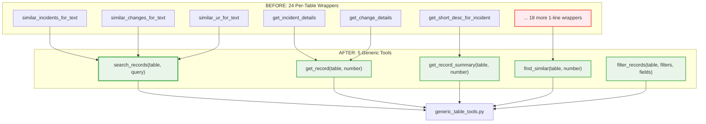
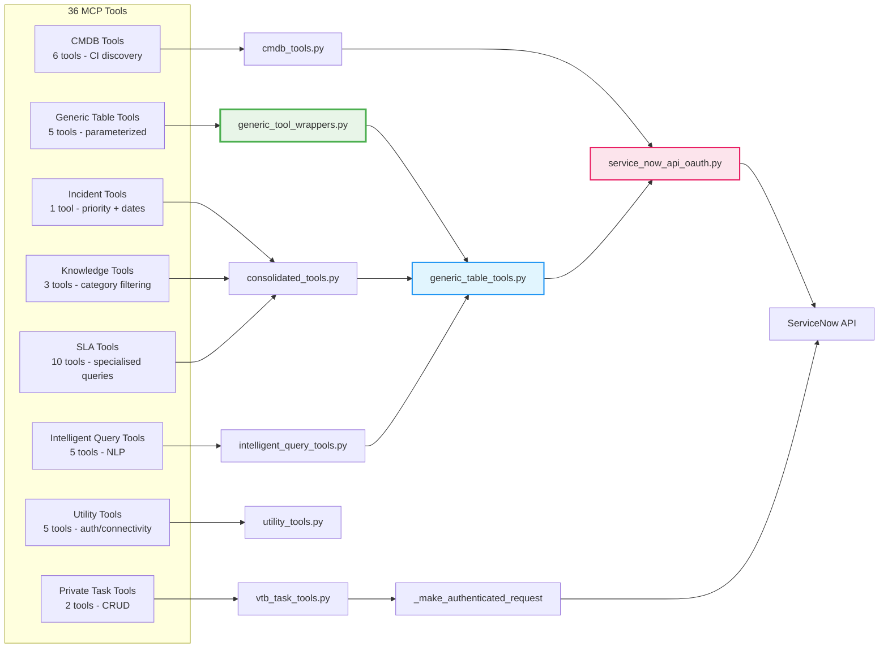
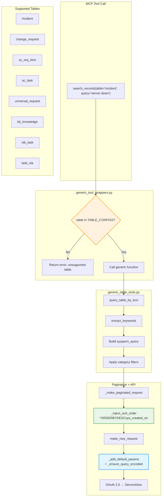

# Tool Organization & Consolidation (v3.0)

This diagram shows the v3.0 architectural transformation: 24 near-duplicate per-table wrappers replaced by 5 generic parameterized tools, reducing from 55 to 36 total tools with zero functional loss.

## Before vs After: v3.0 Consolidation

## v3.0 Tool Categories Overview

## Generic Tool Wrapper Pattern (v3.0)

## Tool Categories Detail

### Generic Table Tools (5 tools — generic_tool_wrappers.py)
Each validates `table` against `TABLE_CONFIGS` and delegates to `generic_table_tools.py`:
- **search_records(table, query)** → `query_table_by_text()` — text-based search
- **get_record(table, number)** → `get_record_details()` — full record by number
- **get_record_summary(table, number)** → `get_record_description()` — short description
- **find_similar(table, number)** → `find_similar_records()` — similarity matching
- **filter_records(table, filters, fields)** → `query_table_with_filters()` — structured filtering

### Consolidated Tools (14 tools — consolidated_tools.py)
Tools with unique logic that cannot be replaced by generic wrappers:
- **Priority Incidents** (1): Complex date logic, metadata, convenience helpers
- **Knowledge** (3): Category/kb_base filtering, active articles
- **SLA** (10): Each has specialised query patterns (breaching, stage, performance, etc.)

### CMDB Tools (6 tools — cmdb_tools.py)
Separate architecture with 100+ CI table types:
- `find_cis_by_type`, `search_cis_by_attributes`, `get_ci_details`
- `similar_cis_for_ci`, `get_all_ci_types`, `quick_ci_search`

### Intelligent Query Tools (5 tools — intelligent_query_tools.py)
NLP-based query processing:
- `intelligent_search`, `explain_servicenow_filters`, `build_smart_servicenow_filter`
- `get_servicenow_filter_templates`, `get_query_examples`

### Utility Tools (5 tools)
- `nowtest`, `now_test_oauth`, `now_auth_info`, `nowtestauth`, `nowtest_auth_input`

### Private Task CRUD (2 tools — vtb_task_tools.py)
- `create_private_task`, `update_private_task` (uses PATCH for partial updates)

## Consolidation Benefits

### Metrics
- **Tools**: 55 → 36 (35% reduction, zero functional loss)
- **Wrappers removed**: 24 one-line functions deleted
- **Dead code removed**: 5 duplicate functions from vtb_task_tools.py
- **Tests**: 537 passing, 80% coverage

### v3.0 API Improvements
- **Performance params**: `sysparm_exclude_reference_link=true` + `sysparm_no_count=true` on all reads
- **URL encoding**: Centralized `sysparm_query` encoding in `make_nws_request()`
- **Deterministic pagination**: `^ORDERBYDESCsys_created_on` appended to all paginated queries
- **HTTP semantics**: PUT → PATCH for partial updates

### Extensibility
1. Add table config to `constants.py`
2. All 5 generic tools automatically support the new table
3. No code duplication required
