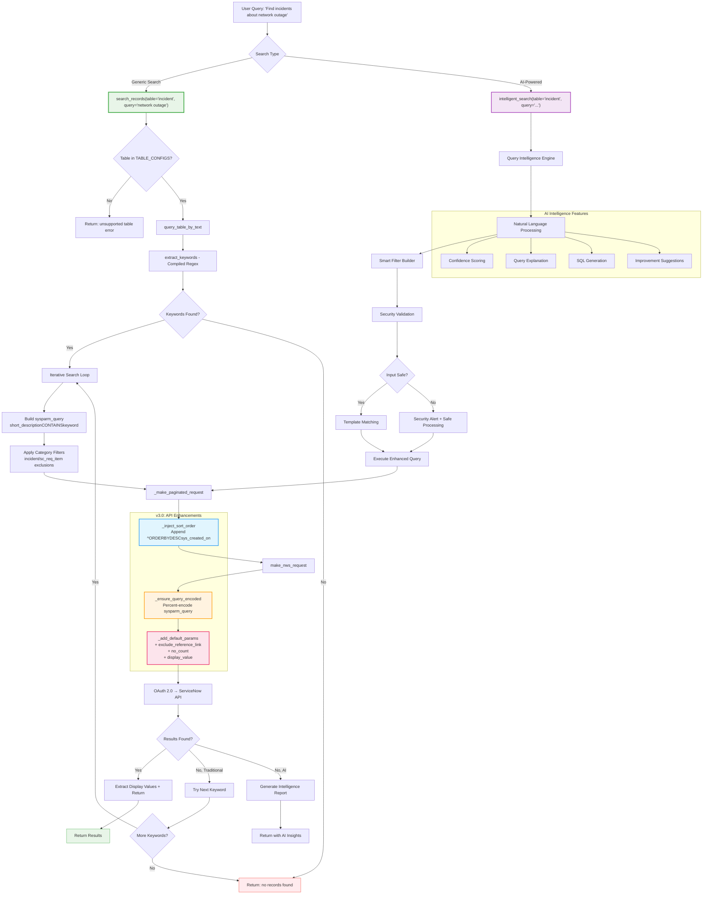

# Similarity Search & Intelligent Query Flow (v3.0)

This flowchart demonstrates the search flow in v3.0, showing both the generic `search_records` tool (replacing per-table wrappers) and the AI-powered `intelligent_search` tool, including the new performance and encoding enhancements.

## Search Flow



## Search Flow Steps

### Generic Search (search_records)
1. **Table Validation**: Validate `table` parameter against `TABLE_CONFIGS` (8 supported tables)
2. **Keyword Extraction**: Compiled regex tokenizes input, filters stop words
3. **Query Construction**: Build `short_descriptionCONTAINSkeyword` for each keyword
4. **Category Filtering**: Apply incident/sc_req_item exclusion filters if enabled
5. **Paginated Request**: Offset-based pagination with deterministic sort order
6. **URL Encoding**: `_ensure_query_encoded()` percent-encodes special characters
7. **Performance Params**: `sysparm_exclude_reference_link=true` + `sysparm_no_count=true`
8. **Early Exit**: Return on first keyword match with results

### AI-Powered Search (intelligent_search)
1. **NLP Processing**: Advanced query parsing with context awareness
2. **Security Validation**: Input sanitization, ReDoS protection
3. **Template Matching**: Enterprise-grade pre-built filter patterns
4. **Smart Filter Generation**: AI-powered ServiceNow syntax creation
5. **Confidence Scoring**: 0.0-1.0 confidence with intelligence metadata
6. **Query Explanation**: Human-readable explanations and SQL equivalents

## v3.0 API Enhancement Details

### Deterministic Pagination (Step 4)
- `_inject_sort_order()` appends `^ORDERBYDESCsys_created_on` to all paginated queries
- Prevents records from being skipped or duplicated across pages
- Respects any existing `ORDERBY` clause in the query
- Callers can override or disable via `default_sort` parameter

### URL Encoding (Step 3)
- `_ensure_query_encoded()` in `make_nws_request()` centralizes encoding
- Unquotes first to prevent double-encoding, then applies `quote(value, safe='=<>&^():@!')`
- Fixes: queries with `&`, `=`, `^`, `#`, or spaces no longer cause silent full-table returns

### Performance Parameters (Step 2)
- `_add_default_params()` injects on all read requests:
  - `sysparm_exclude_reference_link=true` — removes unused reference URLs (reduces token usage)
  - `sysparm_no_count=true` — skips `SELECT COUNT(*)` (reduces latency)
  - `sysparm_display_value=true` — returns human-readable values

## Query Evolution Example

### v3.0 Generic Search
**Input**: `search_records(table="incident", query="network outage in datacenter")`

**Processing**:
1. Table validation: `incident` is in `TABLE_CONFIGS`
2. Keywords extracted: `["network", "outage", "datacenter"]`
3. First query: `short_descriptionCONTAINSnetwork`
4. Category filter applied (if enabled)
5. Sort appended: `^ORDERBYDESCsys_created_on`
6. URL encoded, performance params added
7. Paginated results returned

**Final API URL**:
```
/api/now/table/incident?sysparm_fields=number,short_description,...
&sysparm_query=short_descriptionCONTAINSnetwork^ORDERBYDESCsys_created_on
&sysparm_display_value=true&sysparm_exclude_reference_link=true&sysparm_no_count=true
&sysparm_limit=50&sysparm_offset=0
```

### AI-Powered Search
**Input**: `intelligent_search(table="incident", query="high priority incidents from last week")`

**AI Processing**:
- Time detection: "last week" → date range filter
- Priority intelligence: "high priority" → `priorityIN1,2`
- Confidence: 0.92
- SQL equivalent: `SELECT * FROM incident WHERE priority IN (1,2) AND sys_created_on BETWEEN ...`

---

*The v3.0 search architecture combines generic parameterized tools with centralized API enhancements for reliable, performant queries across all supported tables.*
